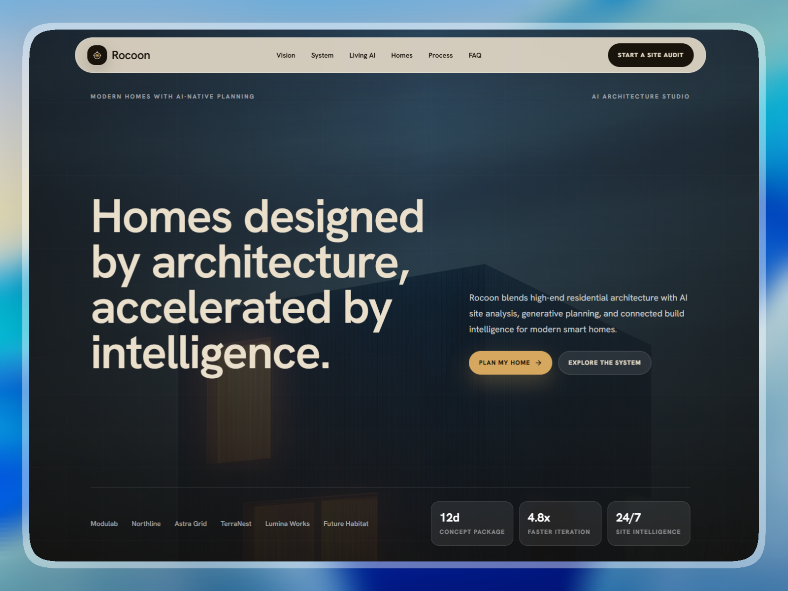

# 🐼 Rocoon — AI Architecture Agency Landing Page

> **Day 16/30 of the "Building 1 AI-Generated Landing Page Every Day" Challenge**



## 🚀 About

Conceptual landing page for **Rocoon**, a **conceptual AI architecture agency** that designs modern smart homes with predictive planning, generative concepts, and connected build intelligence. Developed with **Next.js 16**, **TypeScript**, and **Tailwind CSS 4**. This project is the sixteenth realization of an ambitious challenge: creating **1 complete and functional mockup per day using AI**.

Rocoon is designed to help clients see what a site can become before the first sketch, using AI site analysis, climate-aware planning, smart-home system mapping, and build-ready concept direction. The goal is to provide **modern residential architecture**, **AI-assisted design clarity**, and **connected construction intelligence** through a refined, image-led, bento-inspired digital experience.

Live URL: [https://rocoon-landing.adrielzimbril.com](https://rocoon-landing.adrielzimbril.com)

## 🎨 Design & Aesthetic Decisions

For this project, the theme focuses on **high-end residential architecture, AI-native planning, and calm build confidence**.

- **Architectural Warmth:** A refined ink, cream, copper, and gold palette with large image-led compositions and premium editorial typography.
- **Performance First:** Leveraging Next.js 16's latest features for instant loading and smooth transitions.
- **Bento Grid Layout:** Organizing complex architecture workflows into clear, distinct cards that simulate a real concept and build intelligence system.
- **Purposeful Interactions:** Sticky navigation, expandable FAQ, structured concept cards, and clear visual hierarchy that make the experience feel polished without excess motion.
- **Premium Typography:** Using **Inter** for clarity and **Newsreader** for that editorial, high-end serif aesthetic.

## 🧩 Key Sections

- **🌟 Hero Section:** High-impact introduction with an architectural image, AI studio positioning, trust bar, and performance stats.
- **🏢 Vision Section:** Three-part design intelligence flow covering site scan, AI concepting, and build intelligence.
- **🔄 System Section:** Rocoon OS capability grid for parametric planning, climate intelligence, smart living layers, and material systems.
- **⚡ Homes Gallery:** Image-led modern home concepts with inspectable project metrics.
- **🏗️ Process Section:** Three-step studio workflow with concept command center and customer quotes.
- **💬 FAQ:** Expandable answers for clients evaluating an AI-assisted architecture process.
- **📞 CTA:** Clean site audit section with project brief, build path, and performance intent details.
- **🌐 Footer:** Brand summary, navigation links, contact email, and legal links.

## 🛠️ Tech Stack

This mockup was built with cutting-edge technologies:

- **[Next.js 16](https://nextjs.org/)** with App Router and Turbopack
- **[React 19](https://react.dev/)**
- **TypeScript** for scalable component architecture.
- **[Tailwind CSS v4](https://tailwindcss.com/)** for modern design tokens and utilities.
- **[Motion/React](https://motion.dev/)** for sophisticated entrance and hover animations.
- **[Lenis](https://lenis.darkroom.engineering/)** for smooth scroll behavior.
- **[Lucide React](https://lucide.dev/)** for clean iconography.

## 🚀 Quick Start

```bash
# Install dependencies
pnpm install

# Run development server
pnpm dev
```

Open [http://localhost:3000](http://localhost:3000) in your browser to see the result.

## 🌌 Let's meet in space (or on Earth) 🚀

I'm always happy to discuss new projects, collaborations, or simply exchange creative ideas. Here's how to contact me:

- **📧 Email**: [hello@adrielzimbril.com](mailto:hello@adrielzimbril.com)
- **🌐 Website**: [https://www.adrielzimbril.com](https://www.adrielzimbril.com)
- **🐦 Twitter**: [https://twitter.com/adrielzimbril](https://twitter.com/adrielzimbril)
- **💼 LinkedIn**: [https://www.linkedin.com/in/adrielzimbrilcode](https://www.linkedin.com/in/adrielzimbrilcode)
- **🐼 GitHub**: [https://github.com/adrielzimbril](https://github.com/adrielzimbril)

### 🐼 Fun Facts

- 🚀 Passionate about space exploration and technology
- 🐼 Love pandas (and animals in general!)
- 🎨 Creative at heart, whether in design or code
- ☕ Addicted to coffee and complex technical challenges

## 🌟 Join the Adventure

If you like this project, feel free to:

- ⭐ Star the project
- 🐞 Report bugs
- ✨ Suggest improvements
- 🚀 Share with other enthusiasts

## 💖 Support the Project

If you find this project useful and would like to support its development, you can do so through these platforms:

[](https://go.adrielzimbril.com/gs)

## 🌐 Hosting

This project is 100% hosted on modern cloud infrastructure for maximum performance and reliability:

[](https://vercel.com)

## 📄 License

This project is under the MIT license. Feel free to use it as a base for your own portfolio or project.

---

**Developed with ❤️ by Adriel Zimbril**
_Product Designer & Fullstack Developer_
🚀 Digital Universe Explorer | 🐼 Panda Friend | 🎨 Passionate Creator
